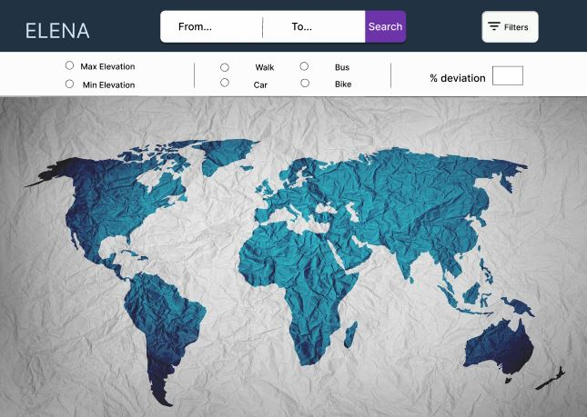
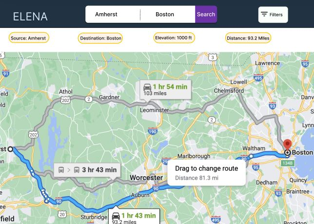

# Elevation Based Navigation - EleNa

## What is Elevation Based Navigation (EleNa)?
Elevation Based Navigation (EleNa) is form of web application that incorporates elevation data for determining optimal routes for navigation. By factoring in elevation data, EleNa can help users identify paths that are either more scenic, challenging, or easier, shortest, or longest depending on their preferences. The goal of this project is to develop a system that, given a source and a destination, determines the optimal path based on users’ preferences. We have provided users with two routing options - maximizing or minimizing elevation gain, and two modes of transportation - walking or biking. The project has scope for further extension by incorporating new modes of transportation, such as bus and car.

## Instructions to Run EleNa
### Quick Start
In order to run the web application, install the required dependencies using `pip install -r requirements.txt` in the `Backend` directory. In the `Frontend/elena_ui` drectory of the project instructions for running React client is provided.

### Watch Demo
//embed youtube link of the presentation

## Tests
The test suits have been developed to facilitate evaluating the functionality of each component.
